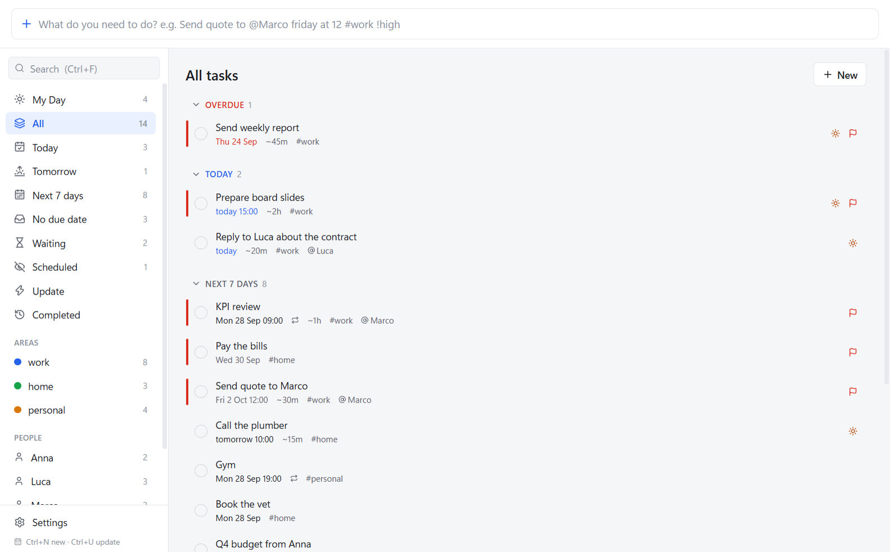
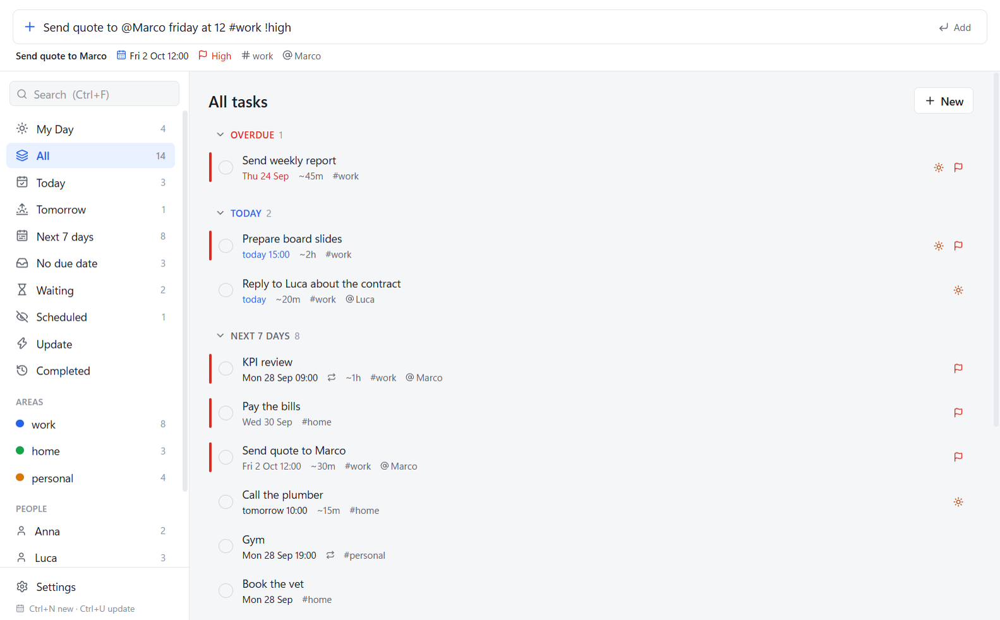
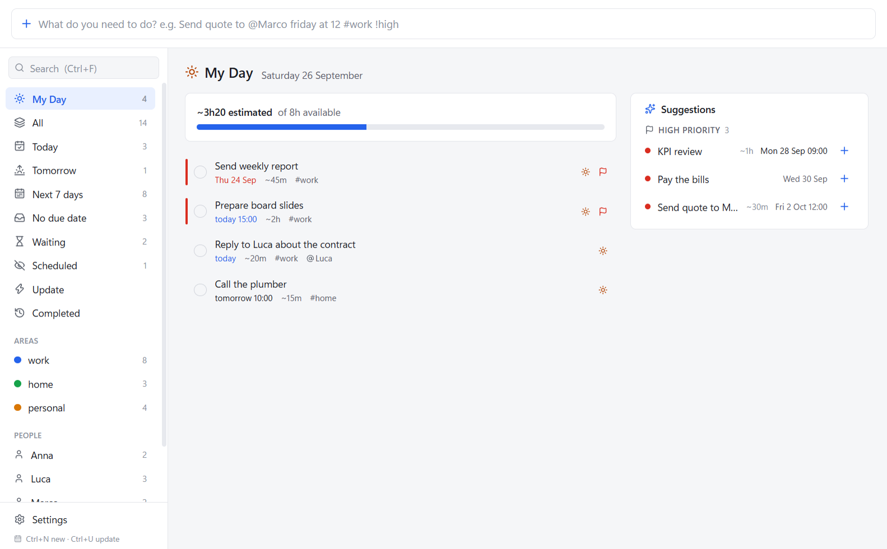
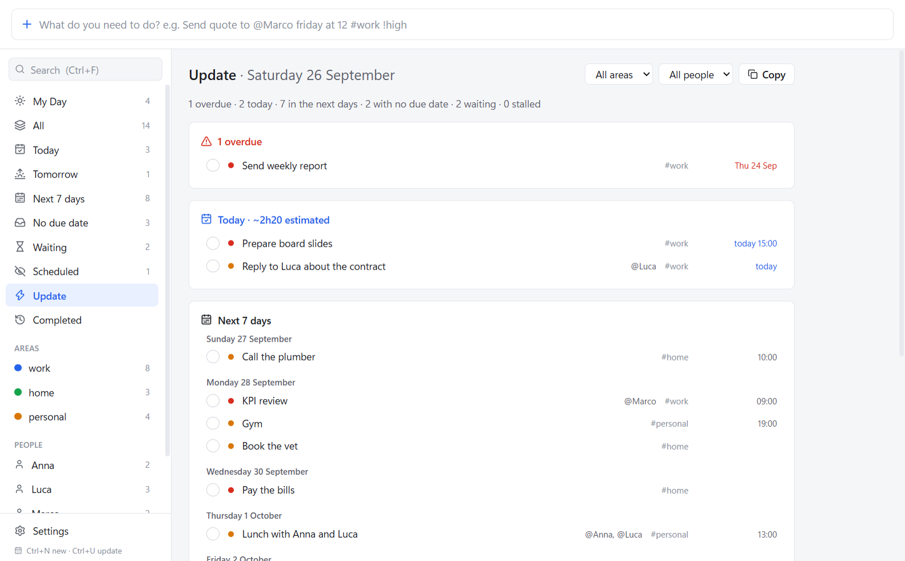
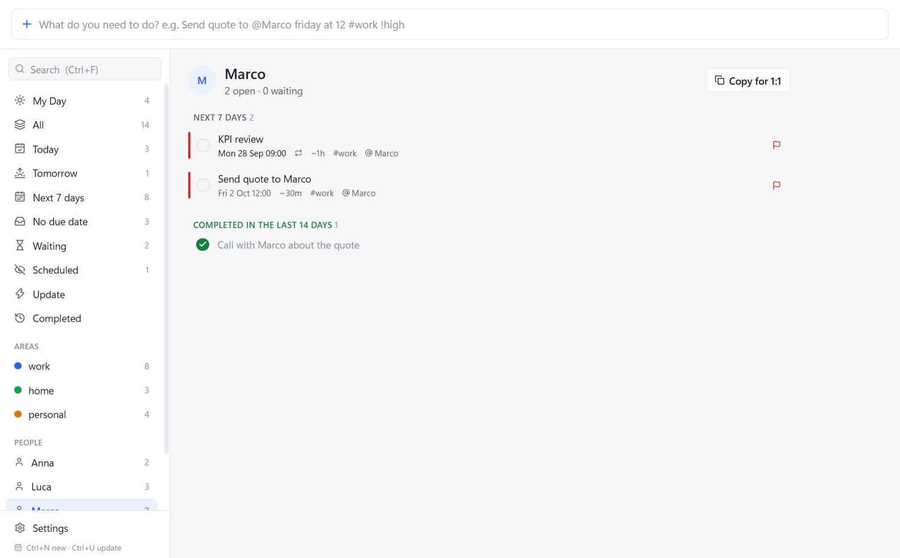
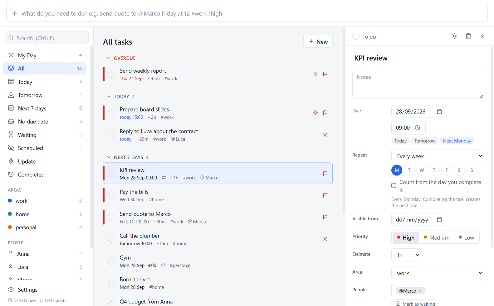
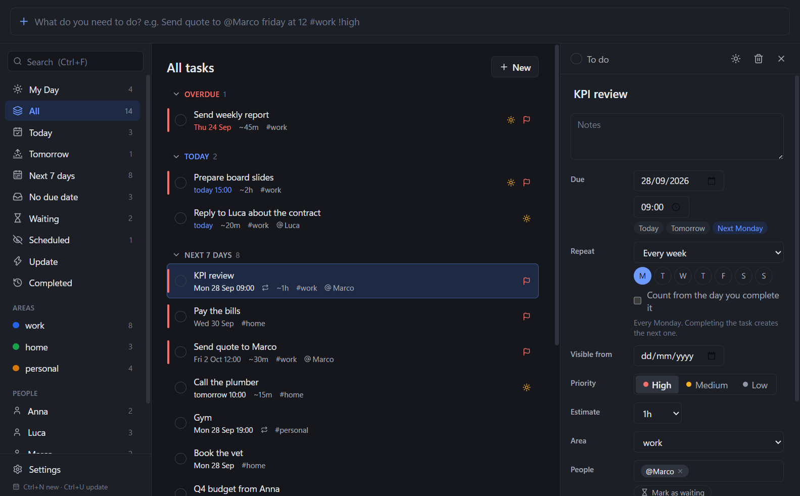

# Plainlist

A to-do app for Windows that works entirely offline. You type a task the way you would say it, for example `Send quote to @Marco friday at 12 #work !high`, and Plainlist works out the date, time, priority, area and people. The app is available in English and Italian.



## Features

- Quick entry in plain English or Italian, with a preview of what was understood as you type
- Tasks grouped by due date: overdue, today, next 7 days, later, no due date, completed
- My Day: pick what to work on today and compare your estimates with the hours you have
- Recurring tasks (`every monday`, `every month on the 5th`, `every 7 days after completion`)
- People: everything related to one person, what you're waiting on from them, and a summary for your 1:1
- Waiting (`+waiting`) and scheduled tasks (`starting monday` hides a task until that day)
- Time estimates (`~30m`, `~2h`)
- Update: a status summary with a suggestion of what to do first, which you can copy as text
- A daily backup to a folder of your choice, OneDrive included
- Starts with Windows, sits in the tray, opens quick add with a global shortcut, shows native notifications
- Light and dark theme, following Windows
- No network access at all. Your data stays in a local SQLite database.

## Screenshots

| | |
|---|---|
|  Quick entry: the line below the box shows how the text was read |  My Day, with the workload bar and suggestions |
|  Update, ready to copy into an email or chat |  Everything about one person |
|  Task details |  Dark theme |

The same screens in Italian are in [docs/screenshots/it](docs/screenshots/it).

## Language

Settings › Language switches between English and Italian. It changes the interface and the words quick entry understands: in English you write `tomorrow`, `!high`, `every monday`, in Italian `domani`, `!alta`, `ogni lunedì`.

A new installation starts in the language of Windows (Italian if Windows is in Italian, English otherwise). The date pickers change format after the app restarts; the notice that appears after switching has a Restart button.

## Quick entry

Recognised parts are removed from the title. Anything that isn't recognised stays in the title and is highlighted in the preview.

| Element | Syntax | Example |
|---|---|---|
| Priority | `!high` `!medium` `!low`, or `!!!` `!!` `!` | `Report !!!` |
| Area | `#name` (the first one; created if it doesn't exist). Without `#`, the default area from Settings | `#home` |
| People | `@Name`, `@Name_Surname` | `@Anna_Smith` |
| Tag | `+tag` | `+urgent` |
| Waiting on someone | `+waiting` (not stored as a tag) | `Budget from @Marco +waiting` |
| Estimate | `~30m`, `~45min`, `~2h`, `~1.5h`, `~1h30` | `Report ~1h` |
| Visible from | `starting`, `starting from`, `from`, `as of` + a date | `Budget starting monday` |
| Repeat | see below | `every monday` |
| Literal text | in quotes, never interpreted | `Read "end of month"` |

People are removed from the title unless they follow a preposition: `Call @Marco` becomes "Call", `Lunch with @Marco and @Anna` becomes "Lunch with Marco and Anna".

Dates and times:

| Type | Meaning |
|---|---|
| `today`, `tonight`, `tomorrow`, `day after tomorrow` | |
| `friday`, `next friday`, `this friday` | the next Friday, not counting today (on a Friday it means in 7 days) |
| `in 3 days`, `in a week`, `in two months` | |
| `next week` | Monday of next week |
| `end of week` | Friday of this week |
| `weekend`, `this weekend`, `next weekend` | Saturday |
| `end of month`, `end of next month`, `next month`, `end of year`, `next year` | |
| `15/10`, `15/10/2027`, `2026-10-15` | day first, then month. Without a year, the next time that date comes round |
| `15 october`, `15th of oct`, `october 15`, `Oct 15th, 2027` | |
| `the 15th`, `on the 1st` | the next 15th or 1st of a month |
| `at 3pm`, `3:30pm`, `at 9:30`, `15:30`, `at noon`, `midnight` | `at 1` to `at 7` without am/pm mean the afternoon. A time on its own means today, or tomorrow if that time has passed |

`by`, `on`, `for`, `due` and `before` in front of a date are absorbed: `by friday`, `due tomorrow`, `on the 15th`. Numbers on their own are never dates (`Buy 3 apples`).

Repeats:

| Type | Meaning |
|---|---|
| `every day`, `daily` | |
| `every weekday`, `on weekdays` | Monday to Friday |
| `every monday`, `every monday and thursday`, `on mondays` | |
| `every week`, `weekly`, `every 2 weeks`, `every other week`, `every 15 days` | |
| `every month`, `monthly`, `every month on the 5th`, `every 5th of the month`, `every end of month` | |
| `every year`, `yearly`, `every 3 months` | |
| … `after completion` | the next date counts from the day you complete the task |

`daily`, `weekly`, `monthly` and `yearly` only count as a repeat at the end of the text or before another instruction (`Standup daily at 9`). Inside a title they stay as words: `Weekly review` is just a title.

A recurring task without a date starts at its first occurrence. Completing it creates the next one; if you completed it late, the new date is the first one after today, with no backlog. If you reopen an occurrence you completed by mistake, the one it generated disappears.

Examples, with today being Thursday 24 September 2026:

| Input | Result |
|---|---|
| `Send quote to @Marco friday at 12 #work !high` | Fri 25 Sep 12:00, high, work, Marco |
| `Book the vet next week` | Mon 28 Sep |
| `Pay the bills by end of month #home !!!` | Wed 30 Sep, high, home |
| `Tax return 15/01` | Fri 15 Jan 2027 |
| `Standup thursday` | Thu 1 Oct (not today) |
| `Pay invoice 31/02` | no date; "31/02" stays in the title and is flagged |
| `KPI review @Marco every monday at 9 ~1h !high` | Mon 28 Sep 09:00, every Monday, 1h, high |
| `Budget review starting monday by 15/10` | hidden until Mon 28 Sep, due Thu 15 Oct |

### In Italian

The same things in Italian:

| English | Italian |
|---|---|
| `today`, `tomorrow`, `day after tomorrow` | `oggi`, `domani`, `dopodomani` |
| `friday`, `next friday` | `venerdì`, `venerdì prossimo` |
| `in 3 days` | `tra 3 giorni`, `fra una settimana` |
| `next week`, `weekend`, `end of month`, `end of year` | `settimana prossima`, `fine settimana`, `fine mese`, `fine anno` |
| `15 october`, `the 15th` | `15 ottobre`, `il 15` |
| `at 3pm`, `at noon` | `alle 15`, `a mezzogiorno` |
| `by friday` | `entro venerdì`, `per il 15 ottobre` |
| `!high` `!medium` `!low` | `!alta` `!media` `!bassa` |
| `+waiting` | `+attesa` |
| `starting monday` | `da lunedì`, `dal 15`, `a partire da domani` |
| `every day`, `every weekday` | `ogni giorno`, `ogni giorno lavorativo` |
| `every monday and thursday` | `ogni lunedì e giovedì`, `tutti i sabati` |
| `every month on the 5th`, `every end of month` | `ogni mese il 5`, `ogni 5 del mese`, `ogni fine mese` |
| `after completion` | `dal completamento`, `dopo il completamento` |

## Views

- My Day: the tasks you picked for today, a bar that compares estimates with your working hours (Settings › Working hours per day), and suggestions: overdue, due today, due tomorrow, high priority. Add a task with the sun icon, by dragging it onto My Day in the sidebar, or from the suggestions. The list clears itself every day, and the morning notification opens this view.
- Waiting: tasks you delegated or are waiting on. They are never suggested as something to do.
- Scheduled: tasks hidden until a date. They come back on their own that day.
- People, in the sidebar: what you're waiting on from a person, their open tasks by due date, and what was completed in the last 14 days. "Copy for 1:1" copies a summary.
- Update: "Copy" puts the summary on the clipboard as text, with the current filters applied.

## Keyboard shortcuts

| Keys | Action |
|---|---|
| `Ctrl+Alt+Space` (can be changed) | Quick add from any program |
| `Ctrl+N` / `Ctrl+Shift+N` | Quick entry / full form |
| `Ctrl+F` | Search |
| `Ctrl+U` | Update |
| `↑` `↓`, `Enter` | Move through the list, open a task |
| `Space` / `Del` | Complete / delete (with undo) |
| `Esc` | Close the details |

If another program already uses the global shortcut, Plainlist tells you and you can choose a different one in Settings.

## Your data

- Tasks are stored in `%APPDATA%\Plainlist\tasks.db` (Settings › Data › Open).
- Before every import, and before an update changes the database structure, a copy is saved in `%APPDATA%\Plainlist\backups\`.
- Every day the app saves everything to `plainlist-YYYY-MM-DD.json` and keeps the last 14 files. This is the same format as Export, so a backup can be imported from Settings › Data › Import. The default folder is `Documents\Plainlist Backup`; you can pick another one in Settings, for example inside OneDrive (OneDrive then does the syncing). If a backup fails you get a notification, at most once a day.
- Uninstalling does not delete your data.

## Installing

`npm run dist` builds `dist/Plainlist-Setup-<version>.exe`, which:

- installs for the current user in `%LOCALAPPDATA%\Programs\Plainlist`, without admin rights
- adds a Start menu shortcut
- can be removed from Windows Settings › Apps

The installer isn't signed, so Windows SmartScreen may show a warning the first time ("More info" › "Run anyway").

To update, raise the version (`npm version minor`), run `npm run dist` and run the new installer. It replaces the program and leaves your data alone; the new version updates the database on first start if needed. If you install a version older than the one that created your data, the app stops with a message instead of opening it.

## Development

You need Windows 10 or 11 (x64) and Node.js 20 or newer; 22 LTS is recommended. Visual Studio Build Tools are not needed, because `better-sqlite3` ships prebuilt binaries that work with both Node and Electron. The installed app doesn't need Node.

```bash
npm install
npm run dev
```

| Command | What it does |
|---|---|
| `npm run dev` | Runs the app with hot reload |
| `npm test` | Runs the tests (Vitest) inside Electron's runtime, the same one the app uses |
| `npm run typecheck` | Type-checks main, preload and renderer |
| `npm run build` | Type-checks and builds into `out/` |
| `npm run dist` | Builds and creates the installer in `dist/` |
| `node scripts/make-icons.mjs` | Regenerates `resources/icon.ico` and `resources/icon.png` |
| `npx electron scripts/screenshots.cjs [en\|it]` | Regenerates the README screenshots after `npm run build`, with demo data in a temporary folder |

### Architecture

```
src/
├─ core/        pure logic, no Electron or database: parser, dates, recurrence, grouping,
│  │            sorting, summary, My Day, person view, copyable text
│  └─ i18n/     English and Italian text (it.ts defines the keys, en.ts must match them)
├─ shared/      types and the typed IPC contract (ipc.ts)
├─ main/        main process
│  ├─ data/     SQLite: migrations, repositories, JSON backup
│  ├─ services/ application logic used by the IPC handlers, testable without Electron
│  ├─ ipc/      handler registration; errors travel as data
│  ├─ system/   tray, autostart, global shortcut, notifications, reminders, automatic backup
│  └─ windows/  main window, quick add, security (CSP, network block)
├─ preload/     exposes window.api through contextBridge, only for declared channels
└─ renderer/    React and Tailwind
```

Security: `contextIsolation` on, `nodeIntegration` off, `sandbox` on, a Content Security Policy in the build, navigation and new windows blocked, and every http/https request blocked (in development only the Vite dev server is allowed). The renderer never touches the filesystem or the database; everything goes through `src/shared/ipc.ts`.

Each process (main, main window, quick add) keeps the current language in `core/i18n` and switches it when the setting changes. Group names and summaries are built in the main process, so they arrive already translated.

The schema already has room for subtasks (`tasks.parent_id`). To change the schema, add a migration in `src/main/data/migrations/` with a higher version number. Never edit one that has already been released.

### Extending the parser

Every expression is a separate rule: Italian rules are in `src/core/parser/rules/`, English ones in `src/core/parser/rules/en/`. To add `this evening` in English as another way of saying today:

1. Create `src/core/parser/rules/en/thisEvening.ts`:

   ```ts
   import { defineRule, wordAt } from '../../types'

   export const enThisEvening = defineRule({
     id: 'en-this-evening',
     kind: 'date',
     match(tokens, i, ctx) {
       return wordAt(tokens, i) === 'this' && wordAt(tokens, i + 1) === 'evening'
         ? { length: 2, status: 'ok', value: ctx.today }
         : null
     }
   })
   ```

2. Add it to `EN_RULES` in `src/core/parser/rules/en/index.ts` (for Italian, `DEFAULT_RULES` in `src/core/parser/rules/index.ts`).
3. Add test cases to `tests/parser.en.test.ts` (Italian: `tests/parser.dates.test.ts` or `tests/parser.syntax.test.ts`).

How a rule works:

- `match(tokens, i, ctx)` receives the tokens (`word` is lowercased and without accents) and the current position. It returns `null` if nothing matches, otherwise how many tokens it uses and the value.
- `kind` is one of `date`, `time`, `priority`, `area`, `person`, `tag`, `recurrence`, `estimate`, `waiting`. The start date has no rules of its own: the parser takes a `date` rule preceded by `starting`/`from` (Italian `da`/`dal`). Prepositions before dates (`by`, `on`, `entro`, `per`…) are handled for you.
- The longest match wins; on a tie, the rule listed first.
- If the text has the right shape but an impossible value, return `{ status: 'invalid', message }`, where `message` is a key of `parser` in `core/i18n` (such as `'invalidDate'`). The text stays in the title and is highlighted in the preview.
- Word lists are in `src/core/parser/lexicon.ts` and `src/core/parser/rules/en/lexicon.ts`; date helpers (`addDays`, `nextWeekday`, `mondayOfNextWeek`…) are in `src/core/time.ts`.

The parser runs in the renderer, for the instant preview, and again in the main process when the task is saved.

### Tests

`npm test` runs about 500 tests:

- `parser.dates.test.ts`, `parser.syntax.test.ts`, `parser.planning.test.ts`: Italian quick entry
- `parser.en.test.ts`: English quick entry
- `i18n.test.ts`: both catalogues have the same keys, English dates, repeats, summaries and notifications, the language setting
- `grouping.test.ts`, `summary.test.ts`: grouping, sorting, summary and the suggestion rule
- `data.test.ts`: migrations, repositories, full-text search, delete with undo, JSON backup
- `service.test.ts`: quick entry and the views used by the interface
- `reminders.test.ts`: alerts, early reminders, notification text
- `time.test.ts`: date arithmetic, daylight saving time, formatting
- `recurrence.test.ts`, `planning.test.ts`: repeats, start dates, estimates, waiting, My Day, people, backup format
- `text.test.ts`, `autoBackup.test.ts`: copyable text, automatic backup

The tests run with `ELECTRON_RUN_AS_NODE`, that is with the Node bundled in Electron, so the native SQLite module is the same one the app uses.

## License

[MIT](LICENSE)
